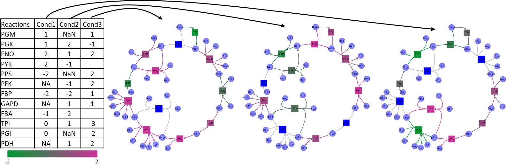
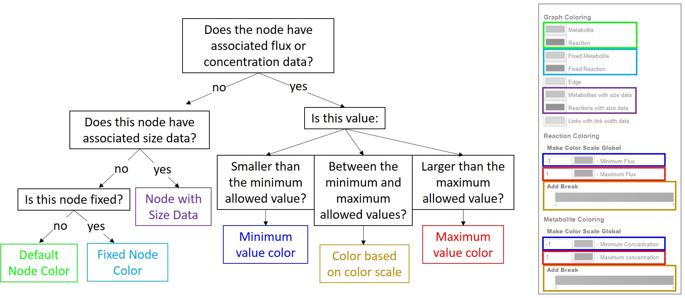

Associated Graph Data
=======================

Reaction nodes can be associated with three types of data:

- **Color Data**: Referred to here as *flux* data, these values are used to color the nodes and the edges associated with the given reaction. When reversing reaction directionality, these values may also be reversed (See *floating menu* section). To upload reaction color data click on *Load Reaction Color Data* in the *Upload/Download* tab in the top menu.
- **Size Data**: Defines the size of the reaction node when present. To upload reaction size data click on *Load Reaction Size Data* in the *Upload/Download* tab in the top menu.
- **Edge Width Data**: Defines the thickness of the edges associated with the given reaction node. To upload edge width data click on *Load Link Width Data* in the *Upload/Download* tab in the top menu.

Metabolite nodes can be associated with two types of data:

- **Color Data**: Referred to here as *concentration* data, these values are used to color metabolite nodes when present. To upload metabolite color data click on *Load Metabolite Color Data* in the *Upload/Download* tab in the top menu.
- **Size Data**: Defines the size of the metabolite node when present. To upload metabolite size data click on *Load Metabolite Size Data* in the *Upload/Download* tab in the top menu.

Color and size scales can be modified following the data upload, and this functionality will be explained in further detail in the following sections. Uploaded data propagates to all nodes in all subgraphs in the given map. That is, if a reaction or metabolite in the file loaded are present in a subgraph different than the one currently displayed, that data will still be assigned to that node. To view the data associated with a given node, turn on the *tooltip* function on the floating menu and hover over the node. Alternatively, if you wish to change any data after it has been uploaded, use the *Edit Attributes* function also in the floating menu. These changes will not be propagated, however. That is, changing the concentration value of pyruvate in the current graph does not change it in other graphs. To remove any data type simply click the **Remove** button next to the given data type in the *Upload/Download* tab in the top menu.

Data files to be uploaded should be formatted as tab delimited text files. The first column should define reaction or metabolite model IDs. Every subsequent column will define values for a different condition. Non-numeric or empty fields are skipped and no data is associated with the node in that condition. Size values loaded are taken as absolute value. If the number of non-empty entries in the header row matches the number of conditions, those are taken to be condition names. If they define one extra entry, it is taken as the header for the ID column and the first entry is discarded. Once data is loaded, a dropdown menus is loaded in the floating menu window where users can navigate the different conditions. The following figure exemplifies a sample data file loaded as reaction color data.

   
   Example of a data file loaded as reaction color data. The file is a tab-delimited text file where the first column defines reaction IDs and every subsequent column defines different conditions. Non-numeric and empty fields are ignored and no data is associated with that node in that condition.

Edge width files are structured similarly to the files described above, and should be defined using reaction IDs. All edges associated with the same reaction will have the same width value. Width values are also loaded as absolute values.

Node and Edge Coloring
========================

Node and edge coloring properties can be managed in the **Coloring** tab in the top menu. Colorscales are defined by a minimum and a maximum value, and optional breaks can be added using the **Add Break** button. Minimum and maximum values are first defined by the minimum and maximum values in the uploaded data, and additional break values must be between these two values. After upload, minimum, maximum, and break values, as well as associated color, can be modified in the **Coloring** tab. Nodes with associated data below the minimum are assigned the minimum color, and nodes with associate value above the maximum are assigned the maximum color.

Colorscales are defined for each data condition loaded (i.e. each column in the data file). This allows users to appropriately color conditions with different meaning (e.g. flux and gene expression) or significantly different ranges of value. To make all reaction or metabolite colorscales the same, simply navigate to the condition with the desired colorscale and click on the **Make Color Scale Global** button under the desired node type.

Nodes with no associated color data but that are given size data are colored according to the **Reaction/Metabolite with size data** color specified in the coloring menu. This allows users to know which nodes are sized according to the loaded data and which nodes are the default size. If no color or size data is present, the nodes are colored according to whether the node is fixed or floating. These options are defined at the top of the coloring menu. The following figure summarizes the decision making process in coloring nodes in the graph.

   
   Flowchart summarizing the decision making process for node coloring. The color of the box at the end of each branch can be matched with the box positioned over the coloring menu on the right, indicating the color of the node. Nodes with color data are colored according to the colorscale. Nodes with no color data but with size data are colored according to the given option, and nodes with no associated data are colored according to whether the node is fixed or not.

Edges can also be colored according to length. This functionality can help identify which edges are being most elongated and are therefore convoluting the map. This functionality can be activated by checking the **Link Stain** box inside the floating menu, which will color all links using a uniform colorscale ranging from the default *Edge* color to the *Link Strain Color*, both defined under the coloring menu. If this functionality is not activated, edges are colored the same color as their associated reaction node when that node has associated flux data. If the associated node has no flux data but the edge does have width data, the edge is colored according to the *Links with link width data* option. Otherwise, links are colored according to the default *Edge* option.

Node and Edge Sizing
========================

If a map has no associated size data in any of its subgraphs, nodes are sized relative to their degree and the scaling factor defined by the *Node size* option in the **Sizing** tab in the top menu. That is, nodes with a higher number of connected edges will be slightly larger. This allows users to quickly identify bottleneck, highly connected metabolites immediately upon loading the model. If any size data is loaded, however, that functionality is removed. Nodes with associated size data will then be sized according to the data, and nodes with no size data are sized according to the default value *Node Size* under the sizing menu.

Edge width will be defined according to associate width data for edges where the data is present, or according to the default *Link Width* under the sizing menu for edges where width data is missing. The default width for edges with no associated width data can be modified using the *Link Width* option in the sizing menu.

The scale of node sizes and edge widths can be defined also under the sizing menu. Each of the three size scales (reaction and metabolite node size and edge width) are defined by three options: *Maximum Size*, *Minimum Size* and *Size Scale*. Nodes and edges with size data below the minimum size will be sized using the minimum value, and nodes and edges with size data above the maximum value will be sized using the maximum value. The size of nodes and edges with associated size data between the minimum and maximum values will be scaled linearly between those two values. 

The third parameter *Size Scale* is a multiplying factor that defines the final node size and edge width. That is, large scale parameters will lead to overall large nodes or thicker edges, while low scale parameters will lead to overall smaller nodes and thinner edges. This allows users to size nodes and edges appropriately independently or the magnitude of the values loaded. These scales are set globally for all data conditions loaded.

The final node size and edge thickness displayed depends on the zoom level of the graph. To load a size reference scale, click on the checkbox *View Size Reference* under the sizing menu. This option will load a reference scale on the top left portion of the graph area which will adjust according to the zoom level.

Mapping Other Types of Omics Data
=====================================

SAMMI offers the functionality of converting gene or protein expression data into associated reaction data directly within the SAMMi interface. This function can be accessed using the *Load Gene Data* in the *Upload/Download* tab in the top menu. Since gene-reaction rules can be expressed in several different ways between different metabolic models, SAMMI offes a number of different tools to convert gene to reaction data. Once this options is selected the supporting menu window will open with the following options:

- **Gene Expression Rule Field**: This option defines which reaction field is to be used in this data mapping (e.g. grRules).
- **Regular Expression to Split**: This field defines a series of regular expressions that can be used to split the string in the field defined above into substrings. These regular expressions should be separated by a semicolon.
- **Regular Expressions to Remove**: This field defines a series of regular expressions that should be removed from the string in the defined field. These should also be separated by semicolons.
- **Select Mapping Function**: Define the function to be used in mapping the associated gene or protein data.

Once these fields are defined, users can push the **Map** button to select the data file to be mapped. The uploaded file should be similar to the reaction and metabolite tab delimited files, where the top row defines multiple conditions and the first column defines the genes to be mapped. Once the file is loaded a series of steps convert the defined field into a vector of associated gene names. These steps are:

1. Remove any characters or substrings matching any of the regular expressions defined under *Regular Expressions to Remove*.
2. Split the resulting string in any of the regular expressions defined under *Regular Expression to Split*.
3. Trim trailing and leading empty spaces.
4. Take unique elements.

For instance, given the gene-reaction rule *100760573 or (100760573 and 100765276)* from the reaction *MAN1PT* in the iCHOv1 reconstruction(`Hefzi et. al.
<https://www.ncbi.nlm.nih.gov/pubmed/27883890>`_), this string can be processed as:

1. Defining *"\\(;\\)"* as the expression to remove we can remove the parenthesis leaving *100760573 or 100760573 and 100765276*.
2. Using *"and;or"* as the splitting expression we can split the string into *[''100760573 '','' 100760573 '','' 100765276'']*.
3. Trimming extra spaces we get *[''100760573'',''100760573'',''100765276'']*.
4. And taking unique entries, finally, we get *[''100760573'',''100765276'']*.

Once the final vector of gene entries is obtained, gene names are replaced by uploaded numerical values, genes for which no value was uploaded are removed, and the defined function is used to obtain a final value for the reaction.