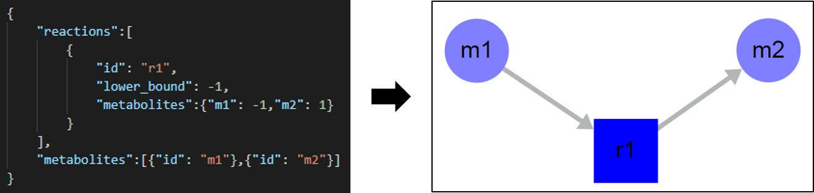

SAMMI Map Format
=======================

As described in the *Loading a Map* section, SAMMI takes files in the SBML format, either in XML, JSON, or SBML file extensions. To load a personalized file, however, users can generate a JSON file with minimal requirements. The file must define a single object with two fields: **reactions** and **metabolites**, each defining a vector of objects. Each object in each of these vectors define a single reaction or metabolite respectively.

Metabolite objects may contain a single field **id** defining a unique metabolite ID. These fields will be extended to metabolite classes when the model is first uploaded into SAMMI. As metabolite nodes are duplicated, unique IDs will be generated for new nodes, but the class field will remain the same defined here. This unique ID generation holds true for all uploaded models. Additional fields may be added to each metabolite (e.g. name or database ID), which will be imported as metabolite data.

Reaction objects must contain two fields. The first is **id**, defining a unique reaction ID. The second is **metabolites**, defining an object where each field is defined by a metabolite ID, and specifies the stoichiometric coefficient of that metabolite in that reaction. Negative values indicated substrates and positive values indicate products. It is strongly recommended to add a third field for reaction lower bounds in order to define reaction reversibility. The name of this field can be changed in SAMMI in the *Upload/Download* tab in the top menu. Additional fields can also be added to reaction objects to be imported as associated reaction data.

   Minimal requirements and format definition for models to be uploaded into SAMMI.
