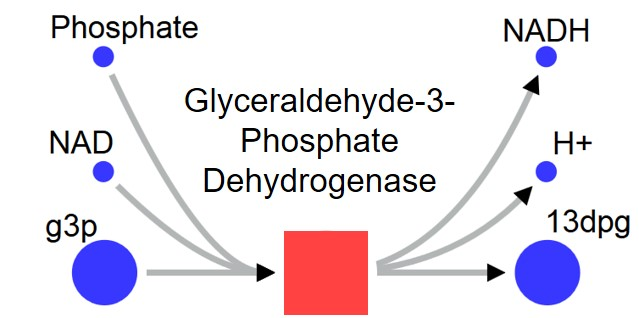

Semi-Automated Metabolic Map Illustrator
==========================================

Welcome to SAMMI, the Semi-Automated Metabolic Map Illustrator. SAMMI is a browser based tool developed for the visualization of metabolic networks. In SAMMI, metabolic networks are illustrated by directed bipartite graphs, where reactions and metabolites represent two distinct groups of nodes. Substrate metabolites connect into reaction nodes, which in turn connect to product metabolites.

   Visual illustration of a metabolic reaction as represented by a bipartite graph.

SAMMI renders metabolic maps as interactive, constantly updated force-directed graphs, allowing for efficient automated node positioning. The tool has also been developed to allow a wide array of node editing and positioning functionalities, as well as easy graph parsing and navigation. SAMMI can be used for both context-specific visualizations, where users can upload their own reaction and/or metabolite data in order to visualize the context of their own network, or to generate visually appealing models that can be easily shared among SAMMI users.

SAMMI has been implemented as a standalone tool available at `www.sammitool.com
<http://www.sammitool.com>`_, and plugins have been developed for `COBRA in MATLAB
<https://sammim.readthedocs.io/en/latest/index.html>`_ and `COBRApy in Python
<https://sammipy.readthedocs.io/en/latest/index.html>`_.

Introductory video
=====================

The following video provides a quick introduction to some of the main functionalities of SAMMI.

.. raw:: html

    

        <iframe width="560" height="315" src="https://www.youtube.com/embed/eMyQA4QbyLo" frameborder="0" allow="accelerometer; autoplay; encrypted-media; gyroscope; picture-in-picture" allowfullscreen></iframe>
    

     

Documentation
=================

The following documentation describes all the tools available in SAMMI.

.. toctree::
   :maxdepth: 2

   loading
   interface
   graphSettings
   data
   secondaries
   navigation
   download
   floating
   shortcuts
   format
   export
   videos
   copyright
   contact

