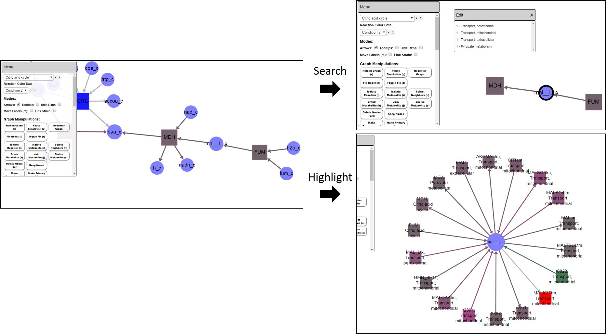

Graph Navigation
==================

While generating multiple subgraphs can lead to more digestible visualizations, and making multiple copies of selected nodes can help produce more visually appealing maps, these representations can hinder the visualization of data continuity. For instance, if a metabolite is produced in a given reaction in a given subgraph, and consumed in another reaction in another subgraph, the continuity of the production and consumption of the given metabolite can be lost in the given visualization. To ameliorate this issue, SAMMI offers two map navigation options.

Node Searching
-----------------

The search functionality in the floating menu allows users to quickly locate nodes throughout the graph. To search for nodes, input the desired text in the input field and push the *Enter* key. All nodes with current labels matching the inputed text will be selected in the graph. That is, searches are performed using the field currently used to label the nodes.

If multiple subgraphs are present, the support menu will be populated with all other subgraphs containing nodes matching the search, as well as the number of matching nodes. To navigate to a different subgraph, simply click on that subgraph in the support menu. To quickly search for a specific node, hold down the *Ctrl* key and click on the node.

Two functionalities can be turned on and off during searches using the checkboxes under the search input field. The **focus** option hides all nodes not associated with a node matching the search. To view all nodes again, simply click anywhere on the graph area. The second option **RegExp** determines whether the inputted text will be taken as a regular expression or as standard text. If this option is on, any node matching the regular expression inputted will be selected. Otherwise, any node containing the inputted text, not considering capitalization, will be selected.

Highlight Metabolite
----------------------

To visualize all the reactions where a metabolite is present, select the desired metabolite and click on the **Highlight Metabolite** button in the floating menu. Alternative, use the keyboard shortcut **h**. This option will load a temporary graph where the selected node will be in the center, and all reactions where that node participates will be represented by a connected reaction node. Subgraph names will be appended to the name of each reaction. This function automatically arranges the associated reaction nodes in a circle. Drag the reference node to increase the circle size and view the reaction names clearly. To navigate to a different subgraph, double-click on the reaction node. To return to the current graph, double click on the graph background.

   
   Plotting multiple subgraphs and making multiple copies of nodes can hinder data visualization continuity. (Left) Visualization of a metabolite balanced flux distribution assures that a reaction in the model must be producing the malate consumed here by MDH, but this reaction must be present in a different subgraph as it is not represented here. (Top right) Searching a node shows in the supporting menu which other subgraphs that node is also present. (Bottom right) Highlighting a node loads a temporary graph presenting all reaction where that node is present. Double-clicking a reaction node takes you to that subgraph, and double clicking the background takes you back to the original graph.