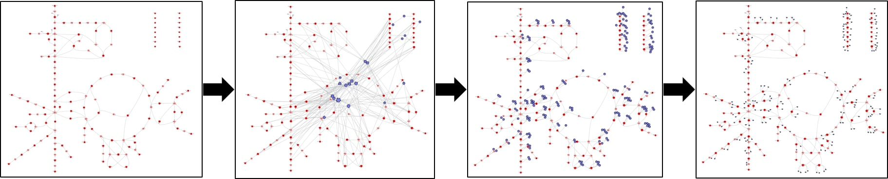

Secondary Metabolites
======================

Many metabolites in metabolic networks, such as water, hydrogen and ATP, are considered "secondary" due to their participation in a large number of reactions and ubiquitous presence in the network. In drawing metabolic networks, these nodes can lead to high connectivity and clutterness in the graph. For that reason, these nodes are often either omitted or repeated several times in the metabolic map. Omitting nodes, however, is most often undesirable since secondary metabolite nodes are important to provide completeness in the network representation. Repeating a node multiple times is most often a more desirable option, and metabolites defined as secondary are often represented by a smaller node to reduce cluttering. This approach, however, can still lead to a significant increase in the number of nodes, which can in turn hinder the process of arranging the nodes for a visually pleasing representation.

While the functionalities of deleting, making multiple copies, and representing secondary metabolites by smaller nodes are all available in SAMMI, an additional functionality of **Shelving** metabolites is also available. By shelving a metabolite, that node is temporarily removed from the graph, but can be re-introduced at a later point. By using this functionality, secondary metabolite nodes can be temporarily removed while primary nodes are arranged in an aesthetically pleasing layout, then reintroduced, split into multiple copies, and labeled as secondary.

   
   On the far left, graph with shelved secondary metabolites has been arranged in a visually pleasing layout. Following that, secondary metabolite nodes are re-introduced, one copy of each secondary node is made for each reaction, and the nodes are labeled as secondary.

Metabolites can be shelved either one at a time using the **Shelve Metabolite* functionality in the floating menu, or using the keyboard shortcut **s**. Both of these will shelve all selected metabolite nodes. Metabolites can also be shelved in a more high throughput manner by uploading a text file containing a list of regular expressions (one expression per line) using the **Load Metabolites to Shelve** option in the **Upload/Download** tab in the top menu. By using this functionality, all metabolites, in all subgraphs, matching any of the uploaded regular expressions will be shelved. Metabolites can be returned to the current graph under the **Shelved Metabolites** section of the floating menu.